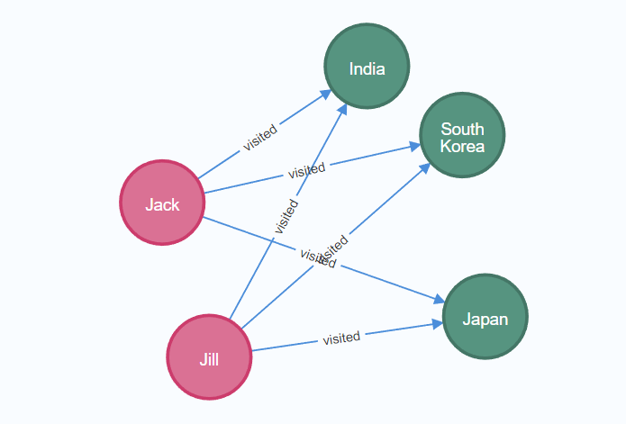
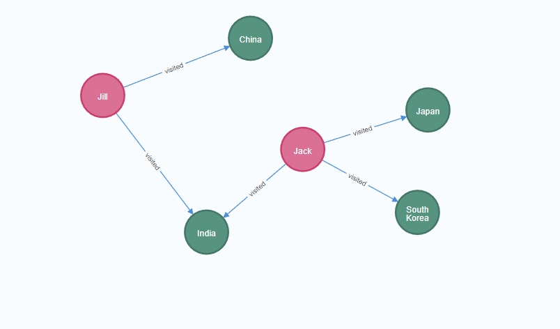
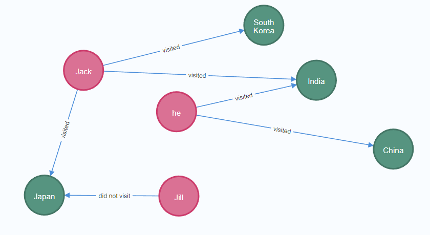

# Welcome to Ruibin Wang's homepage

## Contact

Linkedin: https://www.linkedin.com/in/ruibin-wang-b95569198/

Email: rwang1@bournemouth.ac.uk

&nbsp;

## Introduction

Researcher, PhD Student at National Centre for Computer Animation (NCCA), Bournemouth University.

My research interests focus on: Natural language processing, Deep learning, Chatbot, Dialogue system, Deep learning algorithms, Knowledge Graph

I Collaborated with academic superiors and peers to design the pipeline of the “Intelligent Patient Assistant System” project, and then implement the project's details as a leader. My PhD mainly focuses on the Natural language processing aspect of this project.

My PhD thesis is titled "Knowledge-based dialogue system for automatic diagnosis" and it primarily addresses the following two issues:

* Improve the pre-trained model's performance in the area of medical diagnosis. (Completed)
* Design and implement an automatic diagnosis system based on knowledge graphs. (Doing)

&nbsp;

## Education
2012.9-2016.6  Bachelor's degree,  Applied Mathematics,  Southwest Jiaotong University

2016.9-2019.6  Master's degree,  Vehicle Operation Engineering,  Southwest Jiaotong University

2019.10-       PhD, Natural Language Processing, Bournemouth University

&nbsp;

## Projects

1. **Intel-PA**

    Intelligent Patient Assistant System，UK Higher Education Innovation Fund. I am the Leader of the project. My contribution is shown as follow:

    * Utilized tools like Scrapy, Crawley, and Beautiful-soup to scrape original data from the Web, and then processed them to the training dataset.

    * Used the OCR algorithm to extract the critical text information from patient’s medical records in the form of images, organized and added them to the training dataset.

    * Built a dialogue system for patient diagnosis. Made a demonstration demo of patient consultation, which involves speech recognition, natural language understanding, disease diagnosis, natural language generation and text-to-speech. The technologies include: the traditional hidden Markov model, connection time series classification (CTC) model, end-to-end RNN, bidirectional attention-based LSTM, transformer-based encoder-decoder and reinforcement learning, etc.

    *  A breast cancer diagnostic tool was developed using methods of natural language understanding and decision trees.

    *  A hybrid neural network framework was proposed to assist GP to make an accurate diagnosis, thereby reducing the pressure on the National Health System (NHS), and a paper entitled "Hybrid Architecture Based Intelligent Diagnosis Assistant for GP" was published in the CASA2022 workshop conference. In this article, the classification accuracy of the hybrid network model and general NLP models (CNN, RNN, Bert, Albert, XLnet, etc.) is compared, and a corresponding Webapp was developed. (First issue of my PhD paper was completed)

        * **A demo of the automatic headache diagnose**

            We have designed a simple interactive diagnostic system to determine whether the user has a primary headache. This system simulates the user's real consultation process, and the diagnosis of primary headache can be completed through the audio conversation between the user and the system.

            The code of this project can be found here: [A demo of the Automatic headache diagnose](https://github.com/Intel-PA/diagnose_demo)
    
            The video of this demo can be found here: [The video for the demo](https://drive.google.com/file/d/19BPzHcRFPfZ3jOThq7UvGjTOkYL774g8/view)  

    *  Built a text2KG platform which can extract a sentence's entity-relationship pairings and present them as a picture of knowledge graph. The tools utilized for this are Neo4j and OpenIE.

    *  Recently, focusing on the models of GNN+Transformer and KG+Transformer to improve its word embedding ability and diagnosis accuracy.

    * Also focusing on prompt design of the Chatgpt.

2. **The iGame Project**
This project is funded by EU H2020. My contribution can be found as follow:

    * Used Openpose and CNN to extract the skeleton of patient in a video.

    * Calculated the motion trajectory and motion parameters of the patient in the video.

    * Converted the motion parameter to the "Mell" metric to assess the patient's health.

3. **Teaching & Activities**

    Some activities that I have joined

    * Completed the programme of “Introduction to Education Practice for Postgraduate Research Students” and earned the certificate.

    * Assisted academic supervisor in teaching the Maya+Python course for the undergraduate students.
    
    * Speech of AI and Natural language processing for postgraduate students.

    * Attended the Eastern Europe Machine Learning 2022 summer school and earned the ECTS credits certificate.

4. **Other projects**

    In my master's stage, as the leader for a Chinese National Natural Science Foundation project, my work primarily focused on 3D parametric modelling, and I was also involved in a horizontal project to design a railway disaster rescue system.

* **Knowledge and paper notes**

    * **Paper List**

        Categories of recently read papers：[References](https://github.com/ruibin-wang/github_references)

        &nbsp;

    * **Knowledge notes**

        * RNN for text generation [link](https://github.com/ruibin-wang/ruibin-wang.github.io/blob/main/Learning%20notes/RNN%20for%20text%20generation.pdf)

        * Attention for Seq2Seq model [Link](https://github.com/ruibin-wang/ruibin-wang.github.io/blob/781b5b103afc72255ed856afcf76e2daf24d2259/Learning%20notes/Attention%20for%20Seq2Seq%20model.pdf)

        * Attention [Link](https://github.com/ruibin-wang/ruibin-wang.github.io/blob/781b5b103afc72255ed856afcf76e2daf24d2259/Learning%20notes/Attention.pdf)

        * Making RNNs more effective [Link](https://github.com/ruibin-wang/ruibin-wang.github.io/blob/781b5b103afc72255ed856afcf76e2daf24d2259/Learning%20notes/Making%20RNNs%20more%20effective.pdf)

        * NLP 基础算法梳理One-hot Word2vec Elmo Bert GPT [Link](https://github.com/ruibin-wang/ruibin-wang.github.io/blob/781b5b103afc72255ed856afcf76e2daf24d2259/Learning%20notes/NLP%20%E5%9F%BA%E7%A1%80%E7%AE%97%E6%B3%95%E6%A2%B3%E7%90%86One-hot%20%20Word2vec%20%20Elmo%20%20Bert%20%20GPT.pdf)

        * Self-Attention for Seq2Seq model [Link](https://github.com/ruibin-wang/ruibin-wang.github.io/blob/781b5b103afc72255ed856afcf76e2daf24d2259/Learning%20notes/Self-Attention%20for%20Seq2Seq%20model.pdf)

        * Seq2Seq [Link](https://github.com/ruibin-wang/ruibin-wang.github.io/blob/781b5b103afc72255ed856afcf76e2daf24d2259/Learning%20notes/Seq2Seq.pdf)

        * Softmax and Sigmoid [Link](https://github.com/ruibin-wang/ruibin-wang.github.io/blob/781b5b103afc72255ed856afcf76e2daf24d2259/Learning%20notes/Softmax%20and%20Sigmoid.pdf)

        * Transfer Learning [Link](https://github.com/ruibin-wang/ruibin-wang.github.io/blob/781b5b103afc72255ed856afcf76e2daf24d2259/Learning%20notes/Transfer%20Learning.pdf)

        * What is Precision，Recall，F1score and accuracy [Link](https://github.com/ruibin-wang/ruibin-wang.github.io/blob/781b5b103afc72255ed856afcf76e2daf24d2259/Learning%20notes/%E4%BB%80%E4%B9%88%E6%98%AFPrecision%EF%BC%8CRecall%EF%BC%8CF1score%EF%BC%8C%E4%BB%A5%E5%8F%8Aaccuracy.pdf)

        * Knowledge graph learning [Link](https://github.com/ruibin-wang/Learning-note/blob/6e61d6010e279ac9b94e37fa94ba72fd2d14e763/Knowledge%20graph%20learning.md)

        &nbsp;

* **Survey for UK Film and Virtual Production**

    *  A Survey of the UK Film [Link](https://github.com/Intel-PA/Intel-PA.github.io/blob/jekyll-site/static/ruibin/progress/A%20Survey%20of%20the%20UK%20Film.md)

    * Remote Virtual Production Survey [Link](https://github.com/Intel-PA/Intel-PA.github.io/blob/jekyll-site/static/ruibin/progress/Remote%20Virtual%20Production%20Survey.md)

    &nbsp;

* **Crawl AMBOSS Data from [[weblink](https://www.amboss.com/us/knowledge/index)]**

    * data named *AMBOSS_disease_data.json*: **Access needs permission!!** 

    &nbsp;

* **Paper Named "*Hybrid Architecture Based Intelligent Diagnosis Assistant for GP***"

    * A screen shot of automatic diagnosis webapp 

    

    
    

    * Demonstration video link can be found below:

        https://drive.google.com/file/d/1Ei4406agY8Cnbr01Q1nUEpA0PupWsT1c/view
    

    &nbsp;

        
* **3D modeling**

    modelling in the Maya software for the Veins, arteries, and nerves of the human body.

    

    
    

* **text2KG**

    The details can be found at the link:  https://github.com/ruibin-wang/text2KG

    Three examples:
    * text = "Jack and Jill visited India, Japan and South Korea."
    * text = "Jack visited India, Japan and South Korea, but Jill only visited India and China"
    * text = "Jack visited India, Japan and South Korea, but Jill did not visit Japan, he visited India and China"

    

    
    
    
    

## Publications

* Wang, Ruibin, Jianjun Zhang, Shaojun Bian, and Lihuan You. A Survey of Parametric Modelling Methods for Designing the Head of a High-Speed Train, Proceedings of the Institution of Mechanical Engineers, *Part F: Journal of Rail and Rapid Transit* 232.7 (2018): 1965-1983. [paper](https://journals.sagepub.com/doi/abs/10.1177/0954409718756558) 

* Wang, Shuangbu, Ruibin Wang, Yu Xia, Zhenye Sun, Lihua You, and Jianjun Zhang. Multi-objective aerodynamic optimization of high-speed train heads based on the PDE parametric modeling, *Structural and Multidisciplinary Optimization* (2021): 1-20. [paper](https://link.springer.com/article/10.1007/s00158-021-02916-0)

* Wang, Shuangbu, Yu Xia, Ruibin Wang, Lihua You, and Jianjun Zhang. Optimal NURBS conversion of PDE surface-represented high-speed train heads, *Optimization and Engineering* (2019): 1-22. [paper](https://link.springer.com/article/10.1007/s11081-019-09425-6)

* Xiang, Nan, Ruibin Wang, Tao Jiang, Li Wang, Yanran Li, Xiaosong Yang, and Jianjun Zhang. Sketch‐based modeling with a differentiable renderer, *Computer Animation and Virtual Worlds*, 31.4-5 (2020): e1939. [paper](https://onlinelibrary.wiley.com/doi/full/10.1002/cav.1939) 

* Ruibin Wang, Kavisha	Jayathunge, Rupert Page, Hailing Li, Jianjun Zhang, Xiaosong Yang. Hybrid Architecture Based Intelligent Diagnosis Assistant for GP (CASA2022 workshop)

